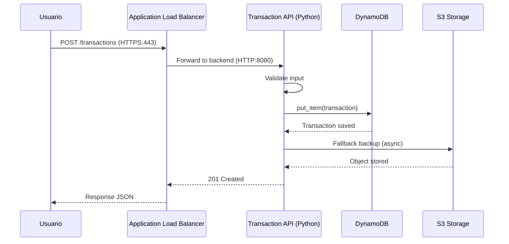
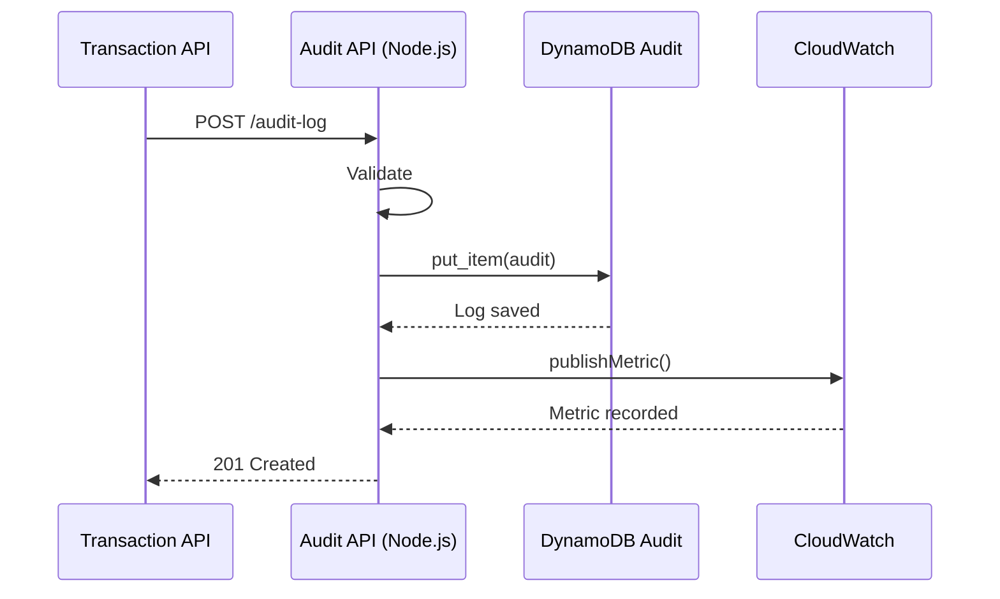
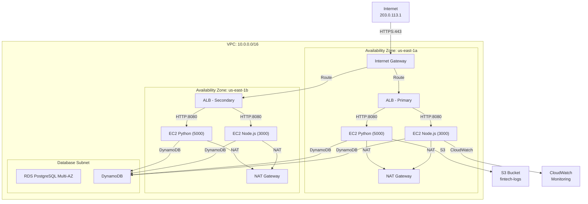
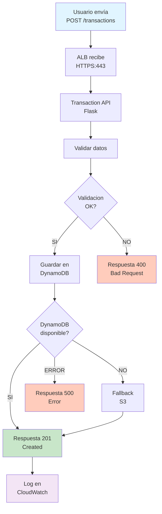
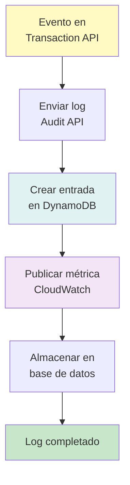
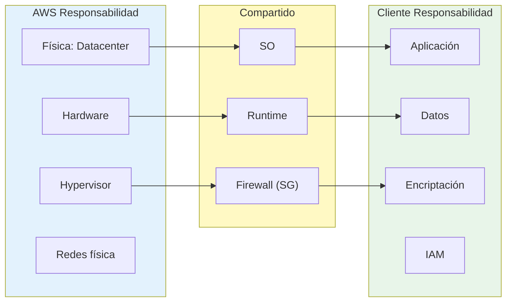
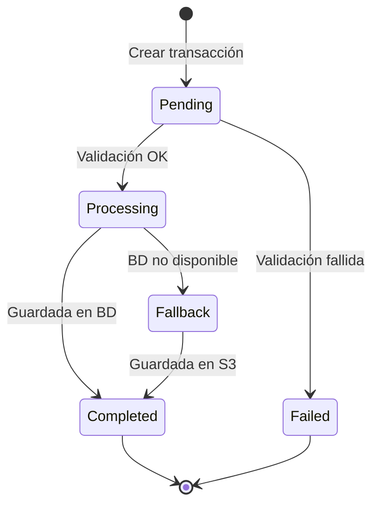
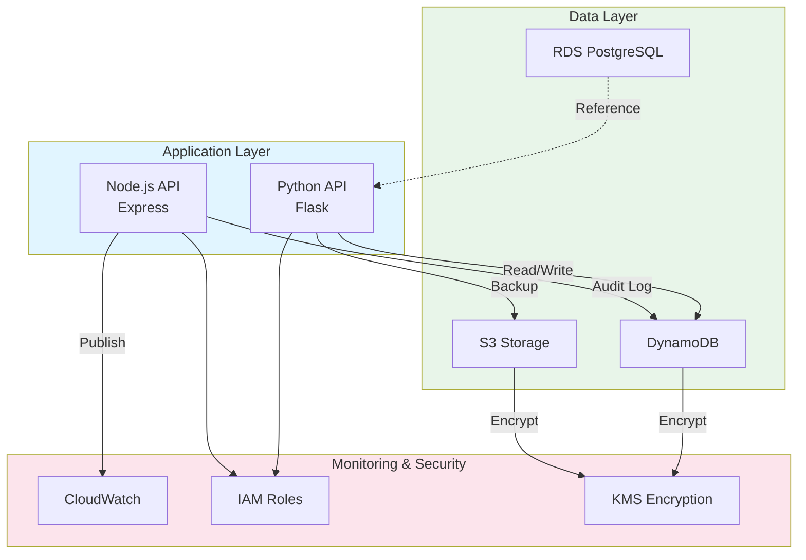
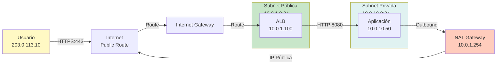
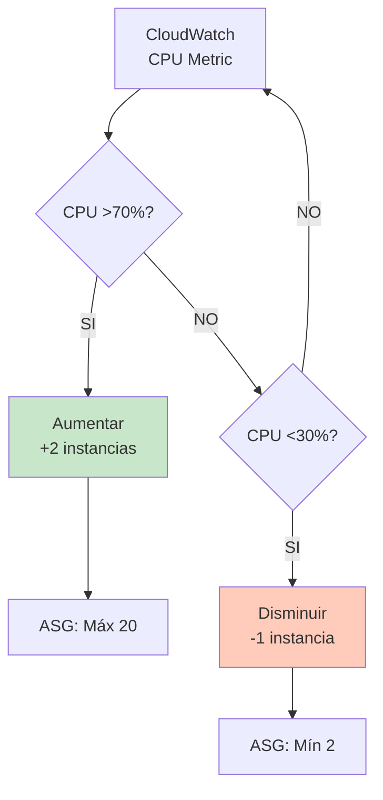

# Diagramas de Arquitectura - Formato Mermaid

Visualización técnica de la arquitectura FinTech con diagramas profesionales sin emojis.

## 1. Diagrama de Secuencia: Flujo de Transacción

## 2. Diagrama de Secuencia: Auditoría de Transacción

## 3. Diagrama de Arquitectura: VPC Multi-AZ

## 4. Diagrama de Flujo: Procesamiento de Transacción

## 5. Diagrama de Flujo: Auditoría

## 6. Diagrama de Responsabilidad: Shared Responsibility Model

## 7. Diagrama de Estado: Transacción Lifecycle

## 8. Diagrama de Componentes: Integración AWS

## 9. Diagrama de Red: Traffic Flow

## 10. Diagrama de Escala: Auto Scaling

## Notas sobre Mermaid

Todos los diagramas usan formato Mermaid profesional:
- Sin emojis
- Nomenclatura técnica clara
- Colores significativos (Verde=OK, Rojo=Alerta, Azul=AWS)
- Flujos legibles sin ambigüedad

Para renderizar estos diagramas:
1. Usar herramienta Mermaid online (mermaid.live)
2. Integrar en documentación markdown
3. Exportar a PNG/SVG para presentaciones

## Integración con Archify

Para crear versiones de alta calidad en Archify:
1. Usar estas definiciones Mermaid como referencia
2. Recrear diagrama en canvas Archify
3. Aplicar color corporativo USAC (naranja)
4. Exportar como PDF para documentación oficial

---

Version: 1.0 - Oficial
Última actualización: Octubre 2026
