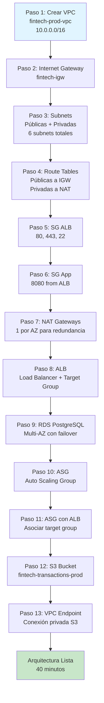
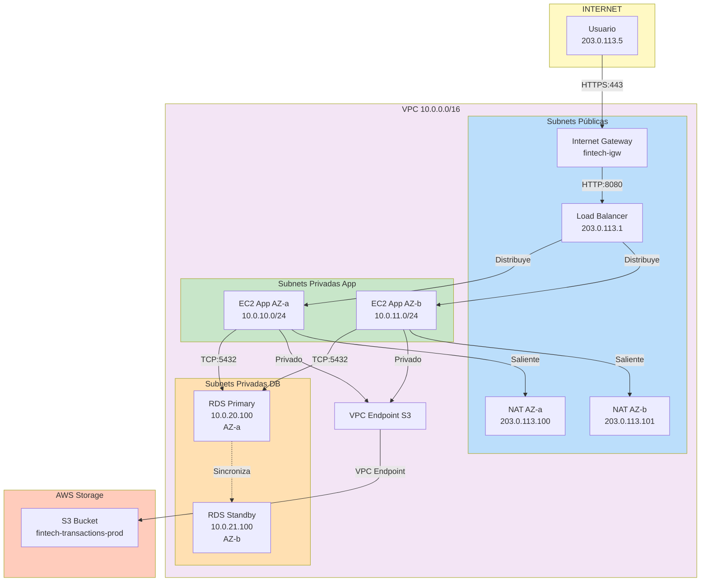
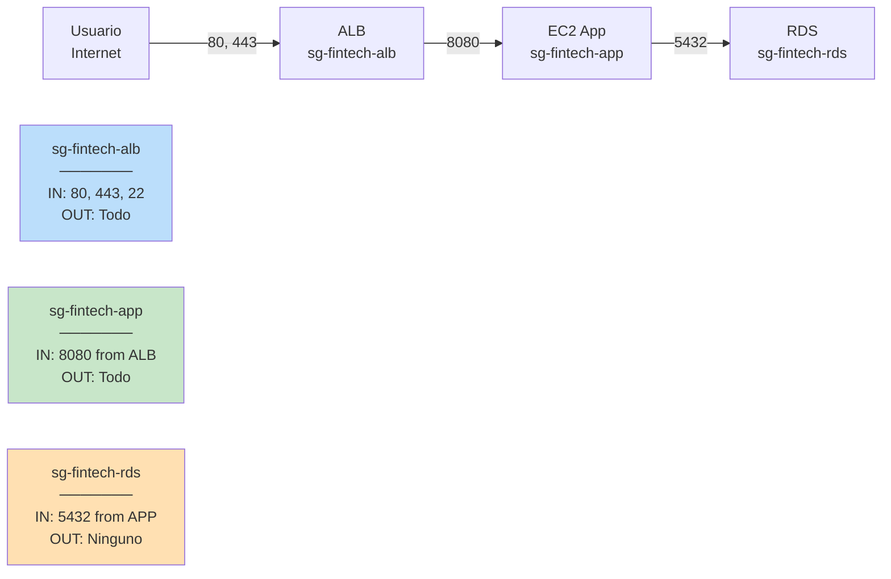
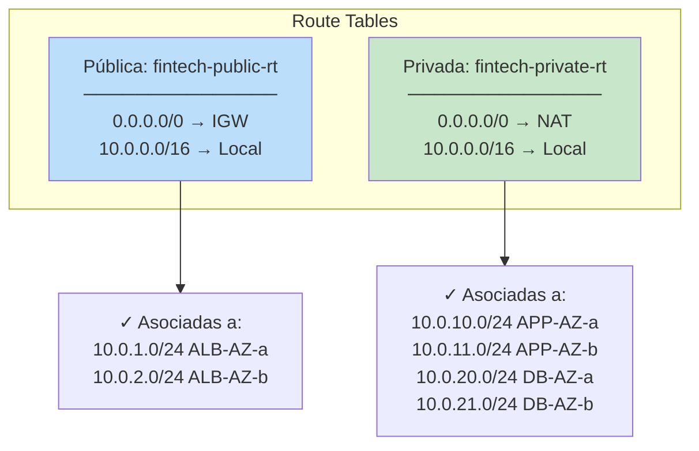
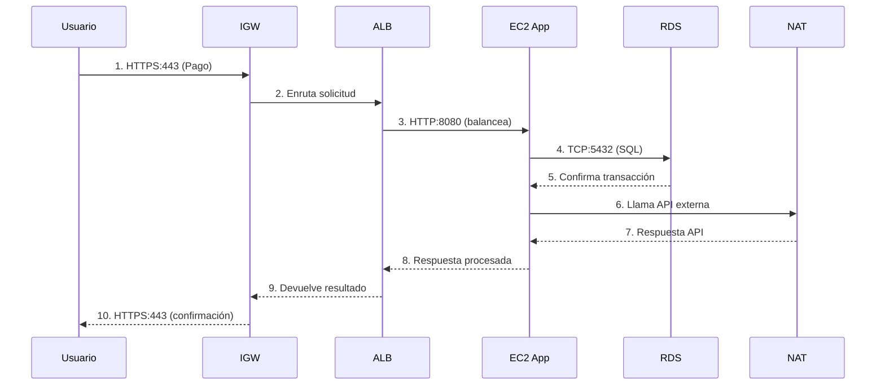

# Pasos de Despliegue - Arquitectura FinTech en AWS

Guía paso-a-paso para desplegar manualmente la arquitectura FinTech en AWS. **Tiempo estimado: 40 minutos**.

---

## Diagrama: Flujo de Despliegue (13 pasos)

<div align="center">



</div>

---

## Diagrama: Arquitectura Final (Componentes y conexiones)



---

## Diagrama: Security Groups y Reglas de Acceso



---

## Diagrama: Route Tables (Enrutamiento de tráfico)



---

## Diagrama: Flujo de Datos (Paso-a-paso de una transacción)



---

## Requisitos Previos

- Cuenta AWS activa con acceso a consola
- Credenciales configuradas en AWS CLI
- Región: us-east-1 (recomendado para este ejemplo)
- Permisos: EC2, RDS, VPC, ALB, ASG, IAM

---

## Paso 1: Crear VPC (5 minutos)

### 1.1 Navegar a VPC Dashboard
```
AWS Console → VPC → Your VPCs → Create VPC
```

### 1.2 Configurar VPC
| Campo | Valor |
|---|---|
| Name | fintech-prod-vpc |
| IPv4 CIDR block | 10.0.0.0/16 |
| IPv6 CIDR block | No IPv6 CIDR block |
| Tenancy | Default |

### 1.3 Habilitar DNS
```
Seleccionar VPC → Acciones → Editar atributos DNS
☑ Habilitar nombres de host DNS
☑ Habilitar resolución DNS
```

---

## Paso 2: Crear Internet Gateway (3 minutos)

### 2.1 Crear IGW
```
VPC Dashboard → Internet Gateways → Create Internet Gateway
```

### 2.2 Configurar IGW
| Campo | Valor |
|---|---|
| Name | fintech-igw |

### 2.3 Attach a VPC
```
Seleccionar IGW → Attach to VPC → fintech-prod-vpc
```

---

## Paso 3: Crear Subnets (5 minutos)

### 3.1 Subred Pública AZ-a
```
VPC Dashboard → Subnets → Create Subnet
```

| Campo | Valor |
|---|---|
| VPC | fintech-prod-vpc |
| Availability Zone | us-east-1a |
| Subnet CIDR block | 10.0.1.0/24 |
| Name | fintech-public-az-a |

### 3.2 Subred Pública AZ-b
| Campo | Valor |
|---|---|
| VPC | fintech-prod-vpc |
| Availability Zone | us-east-1b |
| Subnet CIDR block | 10.0.2.0/24 |
| Name | fintech-public-az-b |

### 3.3 Subred Privada App AZ-a
| Campo | Valor |
|---|---|
| VPC | fintech-prod-vpc |
| Availability Zone | us-east-1a |
| Subnet CIDR block | 10.0.10.0/24 |
| Name | fintech-app-az-a |

### 3.4 Subred Privada App AZ-b
| Campo | Valor |
|---|---|
| VPC | fintech-prod-vpc |
| Availability Zone | us-east-1b |
| Subnet CIDR block | 10.0.11.0/24 |
| Name | fintech-app-az-b |

### 3.5 Subred Privada DB AZ-a
| Campo | Valor |
|---|---|
| VPC | fintech-prod-vpc |
| Availability Zone | us-east-1a |
| Subnet CIDR block | 10.0.20.0/24 |
| Name | fintech-db-az-a |

### 3.6 Subred Privada DB AZ-b
| Campo | Valor |
|---|---|
| VPC | fintech-prod-vpc |
| Availability Zone | us-east-1b |
| Subnet CIDR block | 10.0.21.0/24 |
| Name | fintech-db-az-b |

---

## Paso 4: Configurar Route Tables (5 minutos)

### 4.1 Route Table Pública
```
VPC Dashboard → Route Tables → Create Route Table
```

| Campo | Valor |
|---|---|
| Name | fintech-public-rt |
| VPC | fintech-prod-vpc |

### 4.2 Agregar Ruta a IGW
```
Seleccionar Route Table → Routes → Add Route

Destination: 0.0.0.0/0
Target: fintech-igw
```

### 4.3 Asociar Subredes Públicas a Route Table Pública
```
Seleccionar: fintech-public-rt
→ Subnet Associations → Edit Subnet Associations

Asociar estas 2 subnets públicas:
☑ fintech-public-az-a (10.0.1.0/24)
☑ fintech-public-az-b (10.0.2.0/24)
```

**Resultado**: Las subnets públicas usan fintech-public-rt para enrutar tráfico a IGW

---

### 4.4 Route Table Privada
```
VPC Dashboard → Route Tables → Create Route Table

Name: fintech-private-rt
VPC: fintech-prod-vpc

(Sin agregar ruta a IGW aún, se configura NAT en Paso 7)
```

### 4.5 Asociar Subredes Privadas a Route Table Privada
```
Seleccionar: fintech-private-rt
→ Subnet Associations → Edit Subnet Associations

Asociar estas 4 subnets privadas:
☑ fintech-app-az-a (10.0.10.0/24)
☑ fintech-app-az-b (10.0.11.0/24)
☑ fintech-db-az-a (10.0.20.0/24)
☑ fintech-db-az-b (10.0.21.0/24)
```

**Resultado**: Las subnets privadas usan fintech-private-rt para enrutar tráfico a NAT Gateway

---

## Paso 5: Crear Security Group para ALB (5 minutos)

### 5.1 Crear SG
```
EC2 Dashboard → Security Groups → Create Security Group
```

| Campo | Valor |
|---|---|
| Name | sg-fintech-alb |
| Description | Security Group para ALB FinTech |
| VPC | fintech-prod-vpc |

### 5.2 Configurar Inbound Rules

**Regla 1 - HTTP**:
```
Type: HTTP
Protocol: TCP
Port Range: 80
Source: 0.0.0.0/0 (Cualquiera)
Description: HTTP público
```

**Regla 2 - HTTPS**:
```
Type: HTTPS
Protocol: TCP
Port Range: 443
Source: 0.0.0.0/0 (Cualquiera)
Description: HTTPS público
```

**Regla 3 - SSH (admin)**:
```
Type: SSH
Protocol: TCP
Port Range: 22
Source: 203.0.113.0/24 (Tu IP admin)
Description: SSH administrativo
```

### 5.3 Outbound Rules
```
Dejar default: All traffic a 0.0.0.0/0
```

---

## Paso 6: Crear Security Group para ASG (5 minutos)

### 6.1 Crear SG
| Campo | Valor |
|---|---|
| Name | sg-fintech-app |
| Description | Security Group para EC2 App FinTech |
| VPC | fintech-prod-vpc |

### 6.2 Configurar Inbound Rules

**Regla 1 - App desde ALB**:
```
Type: Custom TCP
Protocol: TCP
Port Range: 8080
Source: sg-fintech-alb (ALB Security Group)
Description: App desde ALB
```

**Regla 2 - SSH desde Admin**:
```
Type: SSH
Protocol: TCP
Port Range: 22
Source: 10.0.0.0/16 (VPC internal)
Description: SSH internal VPC
```

### 6.3 Outbound Rules
```
Type: All TCP
Protocol: TCP
Port Range: 0-65535
Destination: 0.0.0.0/0
Description: Acceso saliente total (BD, internet, S3)
```

---

## Paso 7: Crear NAT Gateways (5 minutos)

### 7.1 Crear Elastic IP para NAT AZ-a
```
EC2 Dashboard → Elastic IPs → Allocate Elastic IP
```

| Campo | Valor |
|---|---|
| Name | eip-nat-az-a |

### 7.2 Crear NAT Gateway en Subnet Pública AZ-a
```
VPC Dashboard → NAT Gateways → Create NAT Gateway
```

| Campo | Valor |
|---|---|
| Subnet | fintech-public-az-a |
| Elastic IP | eip-nat-az-a |
| Name | nat-az-a |

### 7.3 Crear Elastic IP para NAT AZ-b
```
Mismo proceso para AZ-b
```

### 7.4 Crear NAT Gateway en Subnet Pública AZ-b
| Campo | Valor |
|---|---|
| Subnet | fintech-public-az-b |
| Elastic IP | eip-nat-az-b |
| Name | nat-az-b |

### 7.5 Actualizar Route Tables Privadas
```
Route Table fintech-private-rt → Routes → Add Route

Destination: 0.0.0.0/0
Target: nat-az-a (NAT Gateway AZ-a)
```

**Nota**: En producción, crear route tables separadas por AZ (privada-az-a, privada-az-b) para redundancia total.

---

## Paso 8: Crear Application Load Balancer (5 minutos)

### 8.1 Crear ALB
```
EC2 Dashboard → Load Balancers → Create Load Balancer

Type: Application Load Balancer
```

### 8.2 Configurar ALB
| Campo | Valor |
|---|---|
| Name | fintech-alb |
| Scheme | Internet-facing |
| IP type | IPv4 |
| VPC | fintech-prod-vpc |
| Availability Zones | us-east-1a, us-east-1b |
| Subnets | fintech-public-az-a, fintech-public-az-b |

### 8.3 Configurar Security Groups
```
Seleccionar: sg-fintech-alb
```

### 8.4 Crear Target Group
```
EC2 Dashboard → Target Groups → Create Target Group
```

| Campo | Valor |
|---|---|
| Type | Instances |
| Name | fintech-targets |
| Protocol | HTTP |
| Port | 8080 |
| VPC | fintech-prod-vpc |
| Health check path | /health |

### 8.5 Agregar Listener
```
ALB → Listeners and rules

Listener 1 (HTTP):
  Protocol: HTTP
  Port: 80
  Action: Forward to fintech-targets

Listener 2 (HTTPS - opcional):
  Protocol: HTTPS
  Port: 443
  Certificate: (agregar certificado ACM)
  Action: Forward to fintech-targets
```

---

## Paso 9: Crear RDS PostgreSQL (5 minutos)

### 9.1 Crear DB Subnet Group
```
RDS Dashboard → DB Subnet Groups → Create DB Subnet Group
```

| Campo | Valor |
|---|---|
| Name | fintech-db-subnet-group |
| VPC | fintech-prod-vpc |
| Subnets | fintech-db-az-a, fintech-db-az-b |

### 9.2 Crear Security Group para RDS
```
EC2 Dashboard → Security Groups → Create Security Group
```

| Campo | Valor |
|---|---|
| Name | sg-fintech-rds |
| VPC | fintech-prod-vpc |

**Inbound Rule**:
```
Type: PostgreSQL
Protocol: TCP
Port Range: 5432
Source: sg-fintech-app (App Security Group)
```

### 9.3 Crear RDS Instance
```
RDS Dashboard → Databases → Create Database
```

| Campo | Valor |
|---|---|
| Engine | PostgreSQL |
| Version | 14.7 |
| Template | Production |
| DB Cluster ID | fintech-db |
| Master username | postgres |
| Master password | (generar contraseña segura) |

### 9.4 Configurar Red
| Campo | Valor |
|---|---|
| VPC | fintech-prod-vpc |
| DB Subnet Group | fintech-db-subnet-group |
| Publicly accessible | No |
| VPC Security Groups | sg-fintech-rds |

### 9.5 Configurar Storage
| Campo | Valor |
|---|---|
| Storage type | gp3 |
| Allocated storage | 500 GB |
| Enable encryption | Yes (KMS) |

### 9.6 Configurar Backup
| Campo | Valor |
|---|---|
| Backup retention period | 30 days |
| Multi-AZ | Yes (failover automático) |

---

## Paso 10: Crear Auto Scaling Group (5 minutos)

### 10.1 Crear Launch Template
```
EC2 Dashboard → Launch Templates → Create Launch Template
```

| Campo | Valor |
|---|---|
| Name | fintech-app-template |
| AMI | Ubuntu 20.04 LTS (HVM) |
| Instance type | t3.medium |
| Key pair | (seleccionar o crear) |

### 10.2 Configurar Seguridad
```
Security Groups: sg-fintech-app
```

### 10.3 Configurar User Data (script inicio)
```bash
#!/bin/bash
apt-get update
apt-get install -y nodejs npm curl

# Crear directorio app
mkdir -p /opt/app
cd /opt/app

# Descargar código (placeholder)
# git clone <repo> .
# npm install
# npm start &

# Health check
echo "Health check OK" > /tmp/health.txt
```

### 10.4 Crear Auto Scaling Group
```
EC2 Dashboard → Auto Scaling Groups → Create Auto Scaling Group
```

| Campo | Valor |
|---|---|
| Name | fintech-asg |
| Launch Template | fintech-app-template |
| VPC | fintech-prod-vpc |
| Subnets | fintech-app-az-a, fintech-app-az-b |

### 10.5 Configurar Scaling
| Campo | Valor |
|---|---|
| Desired Capacity | 2 |
| Min Size | 2 |
| Max Size | 20 |
| Health Check Type | ELB |
| Health Check Grace Period | 300 seconds |

### 10.6 Agregar Scaling Policies
```
Scaling Policies → Target Tracking

Target metric: CPU Utilization
Target value: 70%
Warmup period: 300 seconds
```

---

## Paso 11: Asociar ASG con ALB (2 minutos)

### 11.1 Agregar Target Group a ASG
```
Auto Scaling Group → Load balancing → Edit

Target Groups: fintech-targets
```

### 11.2 Verificar Health Checks
```
Load Balancer → Target Groups → fintech-targets

Todos los targets deben mostrar: Healthy ✓
```

---

## Paso 12: Crear S3 Bucket para Transacciones (5 minutos)

### 12.1 Crear Bucket
```
S3 Dashboard → Buckets → Create Bucket
```

| Campo | Valor |
|---|---|
| Bucket name | fintech-transactions-prod-<account-id> |
| Region | us-east-1 |
| Block all public access | ☑ (Permitir) |

### 12.2 Habilitar Versionado
```
Bucket → Properties → Versioning → Enable
```

### 12.3 Habilitar Encriptación
```
Bucket → Properties → Encryption → 
Default encryption: SSE-KMS (AWS managed)
```

### 12.4 Habilitar Lifecycle
```
Bucket → Management → Lifecycle Rules

Regla 1:
- Days: 30 → Transition to STANDARD-IA
- Days: 90 → Transition to GLACIER
```

---

## Paso 13: Crear VPC Endpoint para S3 (3 minutos)

### 13.1 Crear Endpoint
```
VPC Dashboard → Endpoints → Create Endpoint
```

| Campo | Valor |
|---|---|
| Service name | com.amazonaws.us-east-1.s3 |
| VPC | fintech-prod-vpc |
| Route tables | fintech-private-rt |
| Policy | Full access a S3 bucket |

---

## Verificación Final

### 13.1 Prueba de Conectividad Cliente → ALB
```bash
# Obtener DNS del ALB
AWS Console → Load Balancers → DNS name

# Probar
curl http://<alb-dns-name>
# Debe devolver: Health check OK o app response
```

### 13.2 Prueba de Conectividad App → RDS
```bash
# SSH a EC2 en ASG
ssh -i key.pem ubuntu@<ec2-private-ip>

# Conectar a RDS
psql -h <rds-endpoint> -U postgres -d postgres
# Debe conectar ✓
```

### 13.3 Prueba de Escalado
```bash
# Generar carga en ALB
ab -n 10000 -c 100 http://<alb-dns-name>/

# Verificar ASG
Auto Scaling Groups → fintech-asg → Activity
# Debe escalar a más instancias ✓
```

---

## Costos Estimados (Monitoreo)

```
CloudWatch Dashboards:
- ALB requests/minute
- EC2 CPU utilization
- RDS connections
- NAT Gateway bytes processed
- S3 storage size
```

---

## Limpieza (Si es necesario)

**ADVERTENCIA: Estos pasos eliminarán recursos y costos acumularán.**

Orden de eliminación (inverso):
1. ASG → Edit → Set desired capacity to 0 → Delete
2. ALB → Delete
3. RDS → Delete (Disable backup)
4. EC2 Instances → Terminate
5. NAT Gateways → Delete
6. Elastic IPs → Release
7. VPC → Delete (elimina automáticamente subnets, route tables)

---

**Tiempo total**: ~40 minutos  
**Costo estimado**: $450/mes para 100 usuarios concurrentes

Para despliegue automatizado, ver `Terraform templates` en documentación.
